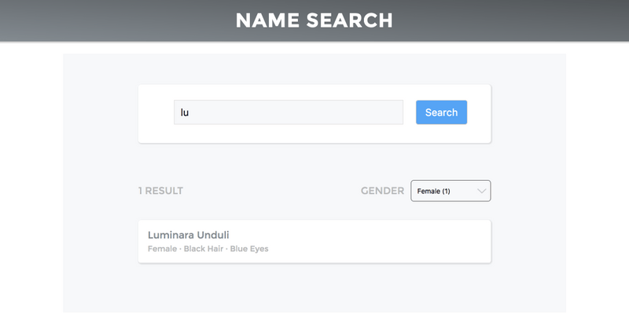

# Star Wars Name Search Project

## Installation

### yarn

```
yarn
yarn start
```

### npm

```
npm install
npm start
```

## Description

This is a simple Star Wars Name Search app using React, Redux, Selectors and Star Wars API (https://swapi.co/).

<p align="center">
 
 
 
</p>
